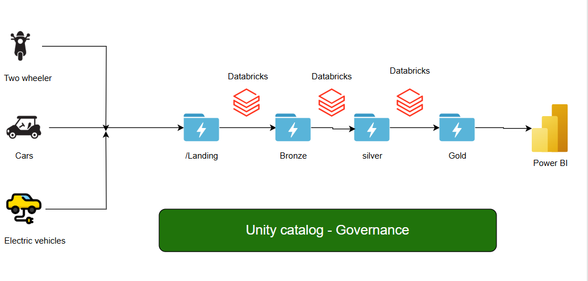

# Real-Time Road and Traffic Data Processing Using Azure Data Engineering

Objective:
The goal of this project is to collect, process, and analyze real-time road and traffic data captured through signal and toll cameras. This data includes details about vehicles (such as type, count, and specific attributes) and road conditions. The processed insights will help improve infrastructure planning, enhance security measures, and monitor the performance of roads and vehicles.

Data Flow and Architecture:
Data Collection:

Sources: Signal cameras and toll cameras provide real-time road and traffic data.
Raw Data Details: Includes vehicle types (e.g., EVs, motorcycles, trucks), vehicle counts, timestamps, road conditions, and metadata from both toll booths and signal intersections.

Ingestion:
Real-time data is ingested into the Landing Container in Azure Data Lake Gen2 via:
APIs for streaming camera data.
Backend Dumps for bulk data transfers.

Bronze Layer (Raw Data Storage):

The raw data from the landing container is moved to the Bronze Folder.
Schema Enforcement: During ingestion, a schema is applied to structure the data.
Format Conversion: The data is stored in Delta Lake format to enable optimized processing.

Tools Used:
Azure Data Factory (ADF) with Structured Streaming for real-time ingestion and processing.
Silver Layer (Refined Data):

Data from the Bronze Layer is processed in Databricks to refine and clean it.
Transformations:
Removal of duplicates.
Handling of missing values (e.g., replacing nulls with default values).
Adding business-specific columns:
EV_Count: Count of electric vehicles.
Motor_Count: Count of motorcycles.
Road_Category: Classification based on usage (e.g., urban, rural).
Road_Type: Type of road (e.g., highway, local road).
The cleaned and transformed data is stored in the Silver Folder.
Gold Layer (Business-Ready Data):

Based on business requirements, additional aggregations and transformations are performed.

Output:
Analytical tables tailored for infrastructure and traffic pattern analysis.
Examples: Peak traffic hours, average vehicle counts per road type, EV penetration rates.
The final data is stored in the Gold Folder.
Data Consumption:

Data from the Gold Layer is made accessible for further analysis and visualization using Power BI.
Real-time dashboards and reports provide actionable insights for stakeholders.

Technologies Used:
Data Ingestion: Azure Data Factory (ADF) with Structured Streaming.
Storage: Azure Data Lake Gen2 with Delta Lake format.
Processing: Databricks (using Spark Structured Streaming).
Visualization: Power BI for creating dashboards and reports.
File Formats: Delta Lake, Parquet.
Data Processing Framework: Apache Spark.

Key Features:
Real-Time Data Processing: The architecture supports streaming data for real-time updates.
Scalable Storage: Delta Lake ensures optimized storage and query performance.
Comprehensive Data Transformation: Handles complex transformations like deduplication, null handling, and custom column generation.
Actionable Insights: The processed data aids in identifying traffic patterns, vehicle trends, and road usage statistics for better decision-making.

